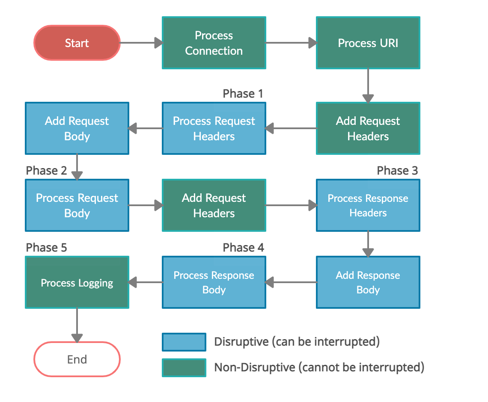

## 5 Phases (per transaction)



### Phase 1: Request Headers

完成读取请求头（post-read-request阶段）后立即处理此阶段中的规则。

此时尚未读取请求体，这意味着并非所有请求参数都可用

### Phase 2: Request Body

### Phase 3: Response Headers

### Phase 4: Response Body

### Phase 5: Logging


## SecRule Syntax

```
SecRule  VARIABLES "@OPERATOR OPERATOR_ARGUMENTS" "ACTIONS"
```

其中，

VARIABLES 变量、OPERATOR 操作、ACTIONS 动作 是必须的

示例，

```
SecRule REMOTE_ADDR "@rx 127.0.0.1" "id:1, phase:1, pass, log, logdata:'Request from localhost'"
```

该规则唯一id=1，在phase 1阶段，检测 REMOTE_ADDR 是否为127.0.0.1，匹配成功后直接pass(放行)，并记录日志(log)

## 常用 Variables

#### ARGS

ARGS 是一个集合，包含参数值，在运行时扩展为更多的变量。

包含所有参数，包括GET和POST

URI : http://www.example.com?x=test&y=test2

ARGS :  {"x" : "test", "y" : "test2"}

#### ARGS_NAMES

包含所有请求参数名称

#### ARGS_GET

ARGS_GET类似于ARGS，但仅包含查询字符串参数。

#### ARGS_GET_NAMES

ARGS_GET_NAMES类似于ARGS_NAMES，但仅包含查询字符串参数的名称。

#### ARGS_POST

ARGS_POST类似于ARGS，但仅包含来自POST请求体的参数。

#### ARGS_POST_NAMES

ARGS_POST_NAMES类似于ARGS_NAMES，但仅包含请求体参数的名称。

#### FILES

包含原始文件名的集合。仅适用于检查通过multipart/form-data形式上传的请求，仅在从请求体中提取文件时可用。

#### FILES_NAMES

包含用于文件上载的表单字段列表。仅适用于检查通过multipart/form-data形式上传的请求。

#### MULTIPART_FILENAME

此变量包含字段FILENAME的multipart数据。

#### QUERY_STRING

包含请求URI的查询字符串部分。 QUERY_STRING中的值始终是原始提供的，不进行URL解码。

#### REMOTE_ADDR

此变量包含远程客户端的IP地址。

#### REQUEST_BASENAME

该变量仅包含REQUEST_FILENAME的文件名部分（例如，index.php）。

#### REQUEST_BODY

包含原始请求体。仅当使用URLENCODED请求体处理器时该变量才有效，即，当检测到application / x-www-form-urlencoded内容类型时，或者强制使用URLENCODED请求体解析器时，此变量才有效。

#### REQUEST_COOKIES

此变量是所有请求cookie的集合（仅包含值）

#### REQUEST_COOKIES_NAMES

此变量是所有请求cookie的名称的集合

#### REQUEST_FILENAME

此变量包含不带查询字符串部分的相对请求URL（例如，/index.php）。

#### REQUEST_HEADERS

此变量可以用作所有请求头的集合，也可以用于检查所指定的请求头内容（通过使用REQUEST_HEADERS:Header-Name语法）。

#### REQUEST_HEADERS_NAMES

此变量是所有请求头的名称的集合。

#### REQUEST_LINE

此变量包含发送到服务器的完整请求行（包括请求方法和HTTP版本信息）。

#### REQUEST_METHOD

此变量包含访问时使用的请求方法。如 GET、POST。

#### REQUEST_URI

该变量包含查询字符串数据在内的完整请求URL（例如，/index.php?p=X）。不包含域名。

#### REQUEST_URI_RAW

与REQUEST_URI相同，但如果在请求行上提供了域名，则包含域名（例如，http://www.example.com/index.php?p=X）。

#### RESPONSE_BODY

此变量包含响应体的数据。

#### TX

该变量代表临时事务集合，用于存储数据片段，创建事务异常分值等。放入此集合的变量仅在事务完成之前可用。
